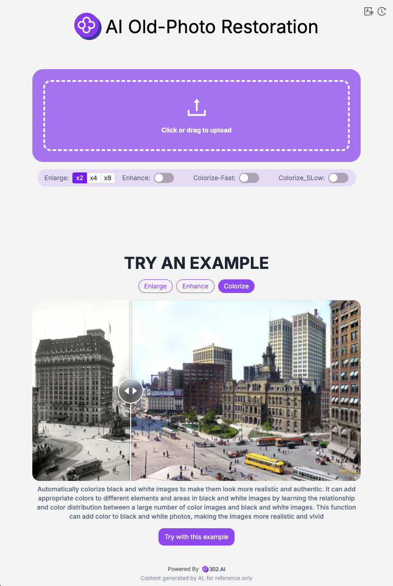

# 🎬🤖 Welcome to 302.AI's AI Old Photo Restoration! 🚀✨

[中文](README_zh.md) | [English](README.md) | [日本語](README_ja.md)

This is the open-source version of the AI Old Photo Restoration from [302.AI](https://302.ai). You can directly log into 302.AI to use the online version with zero coding or base knowledge, or modify and deploy it according to your own needs.

## ✨ Introduction to 302.AI ✨

[302.AI](https://302.ai) is a pay-as-you-go AI application platform that solves the last-mile problem of AI in practice for users.

1. 🧠 It integrates the latest and most comprehensive AI capabilities and brands, including but not limited to language models, image models, sound models, and video models.
2. 🚀 Conducts deep application development on basic models, developing real AI products rather than simple chatbots.
3. 💰 Zero monthly fees, all functions are pay-as-you-go, fully open, achieving truly low threshold and high ceiling.
4. 🛠 Powerful management backend, aimed at teams and small to medium enterprises, managed by one person, used by many.
5. 🔗 All AI capabilities provide API access, and all tools are open-source for customization (ongoing).
6. 💡 Strong development team, launching 2-3 new applications every week, with daily product updates. Developers interested in joining are also welcome to contact us.

## Project Features

1. 🎥 **AI Old Photo Restoration**: Supports image upscaling, character enhancement, black and white coloring, and includes video generation from extended images.
2. 🔄 **Task Management**: Tasks support regeneration.
3. ⚙️ **Multi-model Support**: Various models can be selected to generate videos.
4. 📜 **History Records**: Save your creation history, no memory loss, can be downloaded anytime, anywhere.
5. 🌐 **Internationalization**: Supports multiple languages, currently Chinese, English, and Japanese.

## Technology Stack

- Next.js 14 foundation framework

## Development & Deployment

1. Clone the project `git clone git@github.com:302ai/302_photo_restore.git`
2. Install dependencies `pnpm install`
3. Configure 302's API KEY reference .env.example
4. Run the project `pnpm dev`
5. Package and deploy `docker build -t photo-restore . && docker run -p 3000:3000 photo-restore`

## Interface Preview

