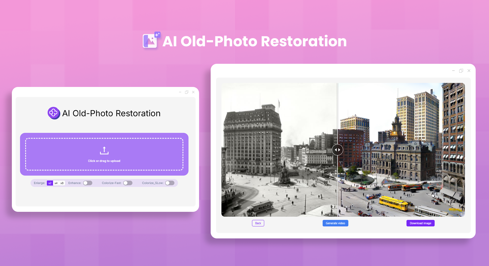
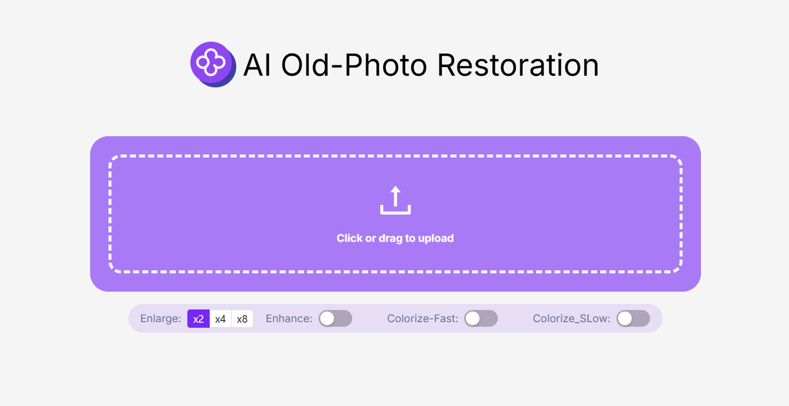
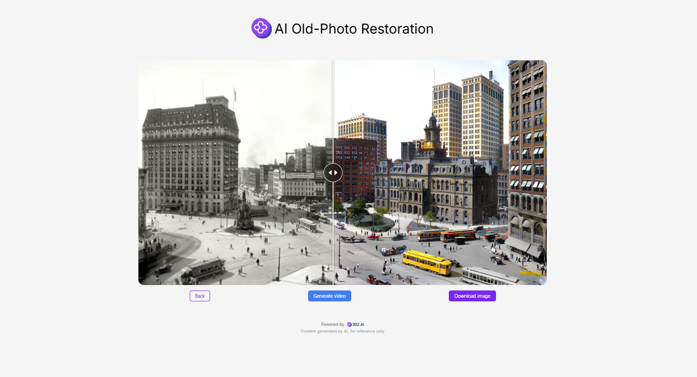

# 
🖼️ AI Old Photo Restoration 🚀✨

AI old photo restoration uses advanced AI models to restore old photos. It provides lossless enlargement functions such as 2x, 4x, and 8x, as well as enhancement and coloring functions. Moreover, it can also generate videos to bring old photos to life.

<a href="README_zh.md">中文</a> | <a href="README.md">English</a> | <a href="README_ja.md">日本語</a>

      

This is the open-source version of the [AI Old Photo Restoration](https://302.ai/en/tools/restoration/) from [302.AI](https://302.ai/en/). You can directly log into 302.AI to use the online version with zero coding or base knowledge, or modify and deploy it according to your own needs.

## Interface Preview
After uploading old photos, you can choose restoration functions such as image enlargement, figure enhancement, and black-and-white coloring.
      

After the photos are restored, you can also expand the pictures to generate videos.

## Project Features

### 🎥 Photo Restoration
It supports restoration functions such as image enlargement, figure enhancement, black-and-white coloring, including expanding pictures to generate videos.
### 🔄 Task Management
Tasks can be regenerated.
### ⚙️ Support for Multiple Models
Various models can be selected to generate videos from old photos.
### 📜 History Records
Save your creation history, no memory loss, can be downloaded anytime, anywhere.
### 🌍 Multi-language Support
- Chinese Interface
- English Interface
- Japanese Interface

## 🚩 Future Update Plans
- [ ] Adding special effects. In addition to the existing basic functions like coloring and enlargement, some special effects with creative and historical restoration value can be added
- [ ] Multi-dimensional restoration and adjustment. In the future, it can be expanded to the recognition, restoration and recovery of text information in photos (such as handwritten remarks on the back of photos, text in seals, etc.), as well as the reasonable adjustment of photo composition (for example, cropping out unnecessary edge parts, correcting tilts, etc.)

## Technology Stack

- Next.js 14 foundation framework

## Development & Deployment

1. Clone the project `git clone git@github.com:302ai/302_photo_restore.git`
2. Install dependencies `pnpm install`
3. Configure 302's API KEY reference .env.example
4. Run the project `pnpm dev`
5. Package and deploy `docker build -t photo-restore . && docker run -p 3000:3000 photo-restore`

## ✨ Introduction to 302.AI ✨

[302.AI](https://302.ai) is an enterprise-oriented AI application platform that offers pay-as-you-go services, ready-to-use solutions, and an open-source ecosystem.✨

1. 🧠 It integrates the latest and most comprehensive AI capabilities and brands, including but not limited to language models, image models, sound models, and video models.
2. 🚀 Conducts deep application development on basic models, developing real AI products rather than simple chatbots.
3. 💰 Zero monthly fees, all functions are pay-as-you-go, fully open, achieving truly low threshold and high ceiling.
4. 🛠 Powerful management backend, aimed at teams and small to medium enterprises, managed by one person, used by many.
5. 🔗 All AI capabilities provide API access, and all tools are open-source for customization (ongoing).
6. 💡 Strong development team, launching 2-3 new applications every week, with daily product updates. Developers interested in joining are also welcome to contact us.
