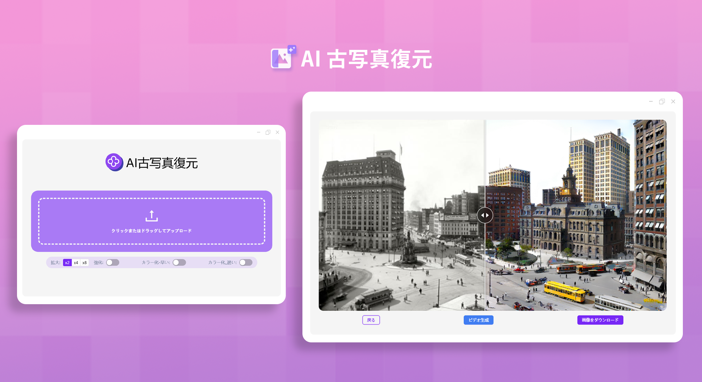
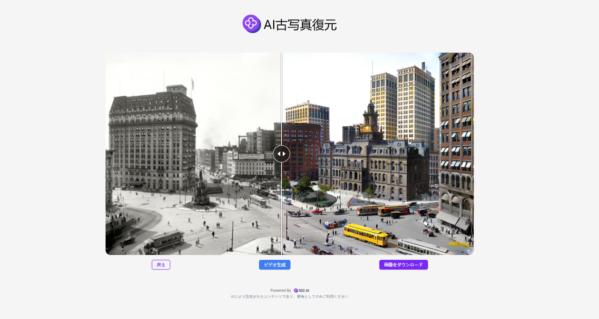

# 
🖼️ AI古写真修復 🚀✨

AI による古い写真の修復は、先進的な AI モデルを利用して古い写真を修復します。2 倍、4 倍、8 倍のノンデストラクティブ拡大や、補強、着色などの機能を提供しており、またビデオを生成して古い写真を動かして見せることもできます。

<a href="README_zh.md">中文</a> | <a href="README.md">English</a> | <a href="README_ja.md">日本語</a>

これは[302.AI](https://302.ai)の[AI古写真修復](https://302.ai/ja/tools/restoration/)のオープンソース版です。302.AIに直接ログインし、コード不要でオンライン版を使用するか、自身のニーズに合わせて修正し、自らデプロイすることができます。

## インターフェイスプレビュー
古い写真をアップロードした後、画像拡大、人物の補強、白黒の着色などの修復機能を選択することができます。
    

写真が修復された後、画像を拡張してビデオを生成することもできます。

## プロジェクト特性

### 🎥 写真修復
画像拡大、人物の補強、白黒の着色などの修復機能をサポートしており、画像を拡張してビデオを生成する機能も含まれています。
### 🔄 タスク管理
タスクの再生成がサポートされています。
### ⚙️ 複数モデルのサポート
古い写真からビデオを生成するために、様々なモデルを選択することができます。
### 📜 履歴機能
作品の履歴を保存し、いつでもどこでもダウンロード可能。
### 🌍 多言語サポート
- 中国語インターフェース
- 英語インターフェース
- 日本語インターフェース

## 🚩 将来のアップデート計画
- [ ] 特殊効果の追加。既存の着色や拡大などの基本的な機能に加えて、創造性と歴史的な復元価値を持つ特殊効果を追加することができます
- [ ] 多次元的な修復と調整。将来的には、写真内の文字情報（写真の裏面の手書きの備考、印章の文字など）の認識と修復・復元、および写真の構図の合理的な調整（例えば、不要な端の部分を切り取る、傾きを修正するなど）にまで拡張することができます

## 技術スタック
- Next.js 14 ベースフレームワーク

## 開発＆デプロイ

1. プロジェクトをクローン `git clone git@github.com:302ai/302_photo_restore.git`
2. 依存関係をインストール `pnpm install`
3. 302のAPI KEYを設定 `.env.example`を参照
4. プロジェクトを実行 `pnpm dev`
5. パッケージ化とデプロイ `docker build -t photo-restore . && docker run -p 3000:3000 photo-restore`

## ✨ 302.AI紹介 ✨

[302.AI](https://302.ai)は企業向けのAIアプリケーションプラットフォームであり、必要に応じて支払い、すぐに使用できるオープンソースのエコシステムです。✨
1. 🧠 言語モデル、画像モデル、音声モデル、動画モデルを含む、最新かつ包括的なAI能力とブランドを集約。
2. 🚀 基本モデルを基にした深度アプリケーション開発。我々は単なるチャットボットではなく、真のAI製品を開発します。
3. 💰 月額料金ゼロ、全ての機能は従量課金制で全面開放、低い敷居と高い上限を実現。
4. 🛠 強力な管理バックエンドを備え、チームや中小企業向けに、一人が管理し複数人が利用可能。
5. 🔗 全てのAI能力にAPI接続を提供し、全てのツールはオープンソースでカスタマイズ可能（進行中）。
6. 💡 強力な開発チームがあり、毎週2-3個の新しいアプリケーションを提供し、製品は毎日更新されます。開発者の参加も歓迎します。
