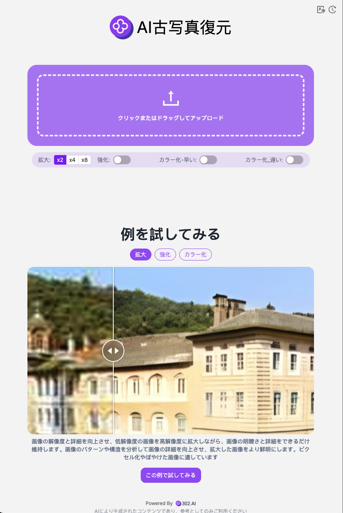

# 🎬🤖 302.AIのAI古写真修復へようこそ! 🚀✨

[中文](README_zh.md) | [English](README.md) | [日本語](README_ja.md)

これは[302.AI](https://302.ai)の[AI古写真修復](https://302.ai/tools/restoration/)のオープンソース版です。302.AIに直接ログインし、コード不要でオンライン版を使用するか、自身のニーズに合わせて修正し、自らデプロイすることができます。

## ✨ 302.AI紹介 ✨

[302.AI](https://302.ai)は、AIを実践で利用する際の最後の一里を解決する、従量課金制のAIアプリケーションプラットフォームです。

1. 🧠 言語モデル、画像モデル、音声モデル、動画モデルを含む、最新かつ包括的なAI能力とブランドを集約。
2. 🚀 基本モデルを基にした深度アプリケーション開発。我々は単なるチャットボットではなく、真のAI製品を開発します。
3. 💰 月額料金ゼロ、全ての機能は従量課金制で全面開放、低い敷居と高い上限を実現。
4. 🛠 強力な管理バックエンドを備え、チームや中小企業向けに、一人が管理し複数人が利用可能。
5. 🔗 全てのAI能力にAPI接続を提供し、全てのツールはオープンソースでカスタマイズ可能（進行中）。
6. 💡 強力な開発チームがあり、毎週2-3個の新しいアプリケーションを提供し、製品は毎日更新されます。開発者の参加も歓迎します。

## プロジェクト特性

1. 🎥 **AI古写真修復**: 画像の拡大、人物強調、白黒カラー化等の機能をサポートし、動画生成へ拡張。
2. 🔄 **タスク管理**: タスクは再生成をサポート。
3. ⚙️ **多モデル対応**: 様々なモデルを選択して動画生成可能。
4. 📜 **履歴機能**: 作品の履歴を保存し、いつでもどこでもダウンロード可能。
5. 🌐 **国際化対応**: 現在は中国語、英語、日本語をサポート。

## 技術スタック

- Next.js 14 ベースフレームワーク

## 開発＆デプロイ

1. プロジェクトをクローン `git clone git@github.com:302ai/302_photo_restore.git`
2. 依存関係をインストール `pnpm install`
3. 302のAPI KEYを設定 `.env.example`を参照
4. プロジェクトを実行 `pnpm dev`
5. パッケージ化とデプロイ `docker build -t photo-restore . && docker run -p 3000:3000 photo-restore`

## インターフェイスプレビュー

