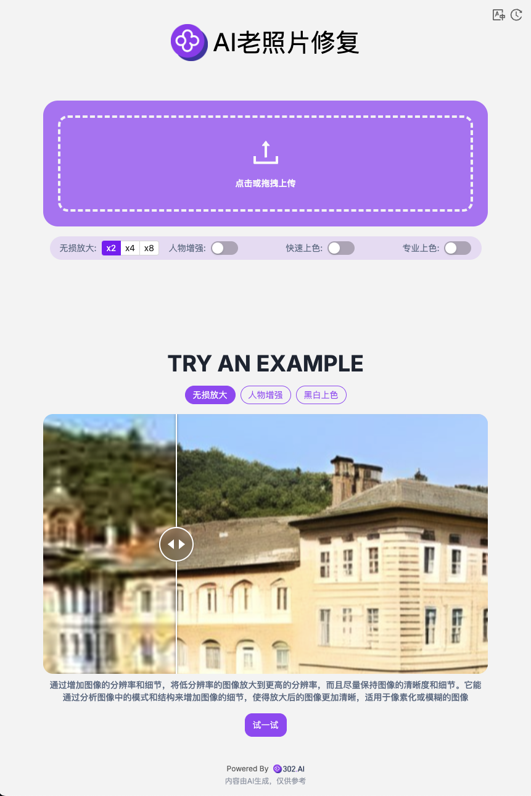

# 🎬🤖 欢迎来到302.AI 的 AI老照片修复! 🚀✨

[中文](README_zh.md) | [English](README.md) | [日本語](README_ja.md)

这是来自[302.AI](https://302.ai)的[AI老照片修复](https://302.ai/tools/restoration/)开源版本。你可以直接登录302.AI，零代码零基础使用在线版本，或根据自己的需求修改并自行部署。

## ✨ 302.AI介绍 ✨

[302.AI](https://302.ai)是一个按需付费的AI应用平台，为用户解决AI用于实践的最后一公里问题。

1. 🧠 集合了最新最全的AI能力和品牌，包括但不限于语言模型、图像模型、声音模型、视频模型。
2. 🚀 在基础模型上进行深度应用开发，我们开发真正的AI产品，而不是简单的对话机器人。
3. 💰 零月费，所有功能按需付费，全面开放，做到真正的门槛低，上限高。
4. 🛠 功能强大的管理后台，面向团队和中小企业，一人管理，多人使用。
5. 🔗 所有AI能力均提供API接入，所有工具开源可自行定制（进行中）。
6. 💡 强大的开发团队，每周推出2-3个新应用，产品每日更新。有兴趣加入的开发者也欢迎联系我们。

## 项目特性

1. 🎥 **AI老照片修复**: 支持图片放大、人物增强、黑白上色等功能，包括拓展图片生成视频。
2. 🔄 **任务管理**: 任务支持重新生成。
3. ⚙️ **多模型支持**: 可选择各种模型生成视频。
4. 📜 **历史记录**: 保存您的创作历史,记忆不丢失，随时随地都可以下载。
5. 🌐 **国际化**: 支持多语言，目前支持中文、英文和日文。

## 技术栈

- Next.js 14 基础框架

## 开发&部署

1. 克隆项目 `git clone git@github.com:302ai/302_photo_restore.git`
2. 安装依赖 `pnpm install`
3. 配置302的API KEY 参考.env.example
4. 运行项目 `pnpm dev`
5. 打包部署 `docker build -t photo-restore . && docker run -p 3000:3000 photo-restore`

## 界面预览

